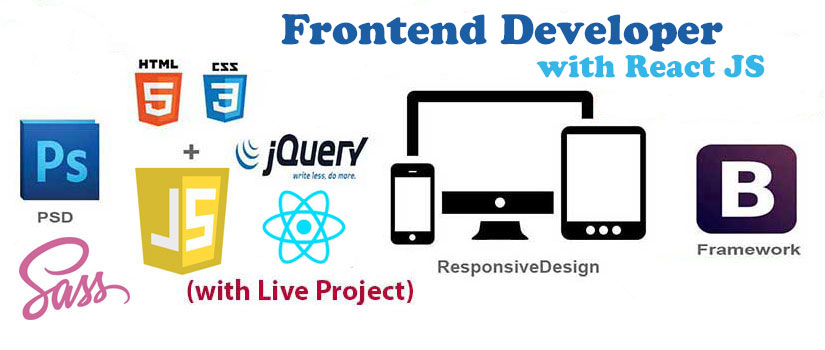

### Hi there 👋, my name Success

#### Software Engineer

I'm a passionate Frontend developer whose whole interest is building interactive, accessible, and responsive websites and web applications. i'm obsessed with building things and i love solving problems with my skills. i love javascript and Reactjs

## SKILLS: 
HTML | CSS | JAVASCRIPT | REACTJS | NODEJS | EXPRESSJS | MONGODB | GIT

- 🔭 I’m currently working on moving listing app 
- 🌱 I’m currently learning Nextjs 
- 👯 I’m looking to collaborate on Reactjs Projects 
- 📫 You can contact me at edesuccess54@gmail.com

        

 

  

  

  

